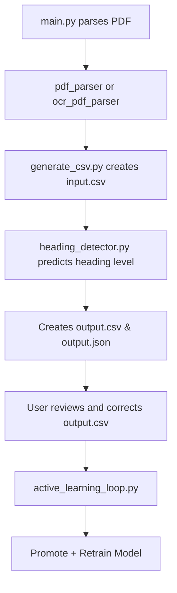

# 🧐 Intelligent PDF Title & Heading Detection System

A smart, self-improving machine learning system that extracts titles and heading structures (H1–H6) from **any kind of PDF document** — structured or scanned — and outputs a clean, hierarchical JSON structure.

---

## 🚀 Key Features

✅ Supports **structured and scanned PDFs**\
✅ Extracts detailed text features from PDFs\
✅ Predicts **title** and **headings** (`H1` to `H6`)\
✅ Automatically ignores non-headings (headers, footers, dates, etc.)\
✅ Combines **heuristic rules** + **Gradient Boosting model**\
✅ Self-improves through an **active learning feedback loop**\
✅ Keeps entire system under **200MB** (for web app compatibility)

---

## 🧰 Technologies & Libraries Used

| Category      | Tool / Library                      | Purpose                                  |
| ------------- | ----------------------------------- | ---------------------------------------- |
| PDF Parsing   | `PyMuPDF (fitz)`                    | Extracts structured text and layout info |
| OCR           | `pdf2image + pytesseract`           | Parses scanned PDF images                |
| ML Model      | `scikit-learn`                      | Training Gradient Boosting model         |
| Data Handling | `pandas`, `joblib`                  | Dataset and model management             |
| Evaluation    | `classification_report`, Matplotlib | Accuracy/F1 display                      |

---

## 🗂 Project Structure

```
project-root/
├── main.py
├── input_pdfs/                  # Folder to place input PDF files
├── output/                      # Final generated output JSON files
├── models/
│   ├── heading_model.pkl         # Trained model
│   └── label_encoder.pkl         # Encodes heading levels
│
├── parsed_csv/
│   ├── input.csv                 # Text block features for new PDFs
│   └── output.csv                # Predicted headings (editable)
│
├── training_data/
│   └── v1/
│       ├── input.csv             # Final labeled input training features
│       └── output.csv            # Corresponding heading labels
│
├── scripts/
│   ├── pdf_parser.py             # Uses PyMuPDF for structured PDFs
│   ├── ocr_pdf_parser.py         # Uses OCR for scanned PDFs
│   ├── auto_detector.py          # Detects PDF type and routes extraction
│   ├── generate_csv.py           # Converts input/output JSON to CSV
│   ├── heading_detector.py       # Core logic to identify headings
│   ├── train_model.py            # Trains the ML model
│   ├── evaluate_model.py         # Evaluates model on test set
│   └── active_learning_loop.py   # Automates promotion + retraining
```

---

## 🧠 Techniques Used

| Technique                           | Explanation                                             |
| ----------------------------------- | ------------------------------------------------------- |
| **Heuristic-Based Detection**       | Uses font size, font weight, spacing, position, etc.    |
| **Rule + Statistical Thresholding** | Learns title/heading font-size distribution dynamically |
| **Gradient Boosting (ML)**          | Trained on manually labeled data for high precision     |
| **Active Learning**                 | Loop to correct model errors and improve over time      |

---

## 🛠 How Each File Works

### 🔹 `main.py`

- Entry point to the pipeline
- Detects type of PDF → extracts features → predicts headings → generates JSON output

### 🔹 `pdf_parser.py`

- Extracts:
  - `text`, `font_size`, `font_name`, `x0/y0/x1/y1`, `alignment`, `line spacing`, `is_bold`, `is_italic`, etc.

### 🔹 `ocr_pdf_parser.py`

- Converts PDF pages to images and uses Tesseract OCR to extract same level of features from scanned PDFs

### 🔹 `auto_detector.py`

- Detects if PDF is scanned or structured and calls the correct parser

### 🔹 `generate_csv.py`

- Converts `input.json` and `output.json` to structured `input.csv` and `output.csv` files

### 🔹 `heading_detector.py`

- Predicts heading levels using both:
  - Trained ML model (`.pkl`)
  - Rule-based heuristics (font size, boldness, alignment, etc.)

### 🔹 `train_model.py`

- Trains a `GradientBoostingClassifier` using:
  - `training_data/v1/input.csv`
  - `training_data/v1/output.csv`

### 🔹 `evaluate_model.py`

- Evaluates model performance using `F1 score`, `accuracy`, `recall`, etc.
- Can be extended to plot charts

### 🔹 `promote_to_training.py`

- Manually move corrected predictions (from `parsed_csv`) into `training_data/` for training

### 🔹 `active_learning_loop.py`

- Automates:
  - Promoting corrected predictions
  - Retraining the model
  - Saving updated `.pkl` model files

---

## 📊 Output Format

The final result is output as a JSON file like:

```json
{
  "title": "Understanding AI",
  "outline": [
    { "level": "H1", "text": "Introduction", "page": 1 },
    { "level": "H2", "text": "What is AI?", "page": 2 },
    { "level": "H3", "text": "History of AI", "page": 3 }
  ]
}
```

---

## 🧰 Workflow Summary



---

## ✅ How to Run

### 1. Install requirements

```bash
pip install -r requirements.txt
```

### 2. Run full pipeline on a new PDF

```bash
python main.py path/to/your/document.pdf
```

### 3. (Optional) Manually correct `parsed_csv/output.csv`

### 4. Retrain using corrected data

```bash
python scripts/active_learning_loop.py
```

### 5. Evaluate model performance

```bash
python scripts/evaluate_model.py
```

---

## 📌 Future Extensions

- ✅ Add a GUI/React UI for correcting predictions
- ✅ Train on multiple languages
- ✅ Export to formats like HTML, DOCX, or Markdown
- ✅ Add chart-based model performance dashboard

---

## 📬 Contact / Contributions

Have feedback or want to contribute?\
Feel free to fork this repo or raise an issue!

---

> Built with 💻 and 💡 by combining rule-based AI and intelligent learning pipelines.
